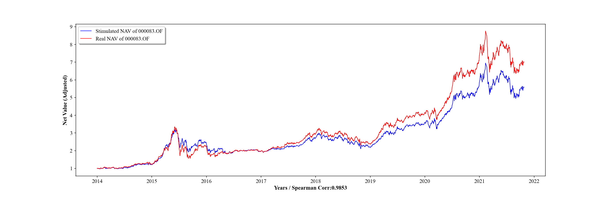
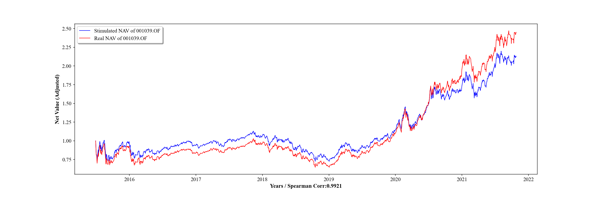

# Position Completion Based on Stock Holding

## Data Description

In China, a mutual fund reports are published seasonally. However, complete position would not be reported except annual report and semi annual report. In 1st and 3rd season, top 10 heavyweight stocks and industry distribution is the only information we can get. **In some research (position chasing, invisible trading ability evaluation, etc), a complete position is must.**

- IndValueToFundNAV:每期报告行业占基金净值比
- ChinaMutualFundStockPortfolio:组合持仓的报告期数据
- StkValuetToFundNAV:基金股票资产占比
- IndustryValueToNAV:每期报告行业占基金净值比
- StkActualPublishDate:股票公告实际发布日期
- FundActualPublishDate:基金公告实际发布日期
- MonthBeginEnd:月初月末表
- StkIndustry:股票行业归属
- FundType:基金类型
- PctStkTotalNAV:基金股票投资总净值
- FundFullName:基金简称和基金全称
- StkBondFundList:偏股混合型基金列表
- StkFundList:普通股票型基金列表
- AShareEODPricesPivot:A股所有股票的收盘价
- LeftStkPricePivot:补充的股票收盘价
- IncomeTTM:用作自下而上的单因子策略的因子，未必是有效的因子
- BaseIndex:偏股混合型基金指数，基准

## Method

- For 2nd and 4th season, we have the proportion of net stock value in the net value of its industry for each stock;
- For 1st and 3rd season, the proportion of all industries in the net fund value minus the corresponding industry net value of the top ten heavyweight stocks, and the rest is the industry net value of the non top ten heavyweight stocks, which is the net value to be distributed;
- In the whole position of the previous quarter, those that are not among the top ten heavy positions of the current quarter are regarded as the positions of non top ten heavy positions of the current quarter;
- The remaining industry net value (i.e. net value to be distributed in 2) after subtracting the top ten heavy positions in this quarter is scaled and distributed to 3 according to the industry net value of stocks in 1;
- The sum of all equity positions would not reach 100%, and the remaining positions will be filled with H11001.CSI(bond index);
- We evaluate the results according to Spearman Corr;

## Compare the Real and Simulated NAV

Although some results are not satisfactory, most simulated NAVs are so similar to that of the real.

## Defects and Improvements

- We complete the position based on stocks only, which means other asset types are excluded (bonds, etc).  There might be a huge gap between the real net-value and the net-value derived from the simulated weights of stock in the portfolio occasionally, but they have a high spearman correlation most of the time. 
- Buys and sells of portfolio manager should be chased. However, I suppose it stays constant. 

